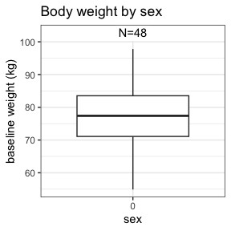

<!-- README.md is generated from README.Rmd. Please edit that file -->

# NIF

<!-- badges: start -->

[](https://CRAN.R-project.org/package=nif)
<!-- badges: end -->

This is a package to create NONMEM input file (NIF) objects from
SDTM-formatted clinical study data.

## Installation

You can install the development version of `nif` like this:

``` r
devtools::install_github("rstrotmann/nif", build_vignettes=TRUE)
```

## Example

### Generate a NIF data set

This is a very basic example using sample SDTM data from a fictional
single ascending dose study to create a NIF data set using `make_nif()`:

``` r
library(nif)
library(tidyverse)

sdtm <- examplinib_sad

nif <- new_nif() %>% 
  add_administration(sdtm, "EXAMPLINIB", analyte = "RS2023") %>% 
  add_observation(sdtm, "pc", "RS2023", analyte = "RS2023")

head(nif)
#>   REF ID    STUDYID           USUBJID AGE SEX  RACE HEIGHT WEIGHT      BMI
#> 1   1  1 2023000001 20230000011010001  54   0 WHITE  178.1     74 23.32942
#> 2   2  1 2023000001 20230000011010001  54   0 WHITE  178.1     74 23.32942
#> 3   3  1 2023000001 20230000011010001  54   0 WHITE  178.1     74 23.32942
#> 4   4  1 2023000001 20230000011010001  54   0 WHITE  178.1     74 23.32942
#> 5   5  1 2023000001 20230000011010001  54   0 WHITE  178.1     74 23.32942
#> 6   6  1 2023000001 20230000011010001  54   0 WHITE  178.1     74 23.32942
#>                   DTC TIME NTIME TAFD TAD PCELTM EVID AMT ANALYTE CMT PARENT
#> 1 2000-12-30 10:20:00  0.0   0.0  0.0 0.0   <NA>    1   5  RS2023   1 RS2023
#> 2 2000-12-30 10:20:00  0.0   0.0  0.0 0.0   PT0H    0   0  RS2023   2 RS2023
#> 3 2000-12-30 10:50:00  0.5   0.5  0.5 0.5 PT0.5H    0   0  RS2023   2 RS2023
#> 4 2000-12-30 11:20:00  1.0   1.0  1.0 1.0   PT1H    0   0  RS2023   2 RS2023
#> 5 2000-12-30 11:50:00  1.5   1.5  1.5 1.5 PT1.5H    0   0  RS2023   2 RS2023
#> 6 2000-12-30 12:20:00  2.0   2.0  2.0 2.0   PT2H    0   0  RS2023   2 RS2023
#>   TRTDY METABOLITE DOSE      DV MDV ACTARMCD                       IMPUTATION
#> 1     1      FALSE    5      NA   1       C1 admin time imputed from PCRFTDTC
#> 2     1      FALSE    5  0.0000   0       C1                                 
#> 3     1      FALSE    5  1.7829   0       C1                                 
#> 4     1      FALSE    5  7.1328   0       C1                                 
#> 5     1      FALSE    5 13.7709   0       C1                                 
#> 6     1      FALSE    5 16.6334   0       C1
```

In many cases, you may want to add further covariates, e.g., baseline
creatinine from the LB domain:

``` r
nif <- nif %>%  
  mutate(COHORT = ACTARMCD) %>% 
  add_baseline(sdtm, "lb", "CREAT") %>% 
  add_bl_crcl()
```

### Data exploration

The `nif` package provides a range of functions to explore and summarize
NIF files:

``` r
summary(nif)
#> ----- NONMEM input file (NIF) object summary -----
#> Data from 48 subjects across one study:
#>  STUDYID      N    
#>  2023000001   48   
#> 
#> Males: 48, females: 0 (0%)
#> 
#> Renal impairment class:
#>  CLASS    N    
#>  mild     4    
#>  normal   44   
#> 
#> Administered drugs:
#>  RS2023
#> 
#> Analytes:
#>  RS2023
#> 
#> Subjects per dose levels:
#>  COHORT   RS2023   N    
#>  C1       5        3    
#>  C10      500      12   
#>  C2       10       3    
#>  C3       20       3    
#>  C4       50       3    
#>  C5       100      6    
#>  C6       200      3    
#>  C7       500      6    
#>  C8       800      6    
#>  C9       1000     3    
#> 
#> 816 observations:
#>  CMT   ANALYTE   N     
#>  2     RS2023    816   
#> 
#> Subjects with dose reductions
#>  RS2023   
#>  0        
#> 
#> Treatment duration overview:
#>  PARENT   min   max   mean   median   
#>  RS2023   1     1     1      1

invisible(capture.output(
  summary(nif) %>%
    plot()
))
```



# Further information

For further guidance see the help for individual functions and the
[project website](https://rstrotmann.github.io/nif/) on github pages.
