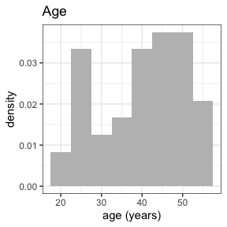
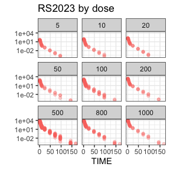

<!-- README.md is generated from README.Rmd. Please edit that file -->

<!-- badges: start -->

[](https://github.com/rstrotmann/nif/actions/workflows/R-CMD-check.yaml)
<!-- badges: end -->

# NIF

This is a package to create NONMEM Input Format (NIF) data tables from
SDTM-formatted clinical study data.

The [NONMEM](https://www.iconplc.com/solutions/technologies/nonmem)
software that is often used for population
pharmacokinetic/pharmacodynamic (PK/PD) modeling expects the input data
set to follow specific conventions summarized in *Bauer, R.J. (2019),
NONMEM Tutorial Part I: Description of Commands and Options, With Simple
Examples of Population Analysis. CPT Pharmacometrics Syst. Pharmacol.,
8: 525-537*, <https://doi.org/10.1002/psp4.12404>.

This package provides functions to sequentially aggregate drug
administrations, PK/PD observations and covariates into a
NONMEM-compliant analysis data set (NIF data set), and tools to explore
and visualize NIF data sets.

## Installation

You can install the development version of `nif` like this:

``` r
devtools::install_github("rstrotmann/nif", build_vignettes=TRUE)
```

## Example

### Generate a NIF data set

This is a very basic example using sample SDTM data from a fictional
single ascending dose study to create a NIF data set using `make_nif()`:

``` r
library(nif)
library(tidyverse)

sdtm <- examplinib_sad

nif <- nif() %>%
  add_administration(sdtm, "EXAMPLINIB", analyte = "RS2023") %>%
  add_observation(sdtm, "pc", "RS2023", analyte = "RS2023")

head(nif)
#>   REF ID    STUDYID           USUBJID AGE SEX  RACE HEIGHT WEIGHT     BMI
#> 1   1  1 2023000001 20230000011010001  43   0 WHITE  187.4     77 21.9256
#> 2   2  1 2023000001 20230000011010001  43   0 WHITE  187.4     77 21.9256
#> 3   3  1 2023000001 20230000011010001  43   0 WHITE  187.4     77 21.9256
#> 4   4  1 2023000001 20230000011010001  43   0 WHITE  187.4     77 21.9256
#> 5   5  1 2023000001 20230000011010001  43   0 WHITE  187.4     77 21.9256
#> 6   6  1 2023000001 20230000011010001  43   0 WHITE  187.4     77 21.9256
#>                   DTC TIME NTIME TAFD TAD EVID AMT ANALYTE CMT PARENT TRTDY
#> 1 2000-12-31 10:18:00  0.0   0.0  0.0 0.0    1   5  RS2023   1 RS2023     1
#> 2 2000-12-31 10:18:00  0.0   0.0  0.0 0.0    0   0  RS2023   2 RS2023     1
#> 3 2000-12-31 10:48:00  0.5   0.5  0.5 0.5    0   0  RS2023   2 RS2023     1
#> 4 2000-12-31 11:18:00  1.0   1.0  1.0 1.0    0   0  RS2023   2 RS2023     1
#> 5 2000-12-31 11:48:00  1.5   1.5  1.5 1.5    0   0  RS2023   2 RS2023     1
#> 6 2000-12-31 12:18:00  2.0   2.0  2.0 2.0    0   0  RS2023   2 RS2023     1
#>   METABOLITE DOSE MDV ACTARMCD IMPUTATION      DV
#> 1      FALSE    5   1       C1                 NA
#> 2      FALSE    5   0       C1             0.0000
#> 3      FALSE    5   0       C1            40.7852
#> 4      FALSE    5   0       C1            48.5530
#> 5      FALSE    5   0       C1            44.0391
#> 6      FALSE    5   0       C1            34.0729
```

In many cases, you may want to add further covariates, e.g., baseline
creatinine from the LB domain:

``` r
nif <- nif %>%
  mutate(COHORT = ACTARMCD) %>%
  add_baseline(sdtm, "lb", "CREAT") %>%
  add_bl_crcl()
#> baseline_filter for BL_CREAT set to LBBLFL == 'Y'
```

### Data exploration

The `nif` package provides a range of functions to explore and summarize
NIF files:

``` r
summary(nif)
#> ----- NONMEM Input Format (NIF) data summary -----
#> Data from 48 subjects across one study:
#>   STUDYID      N    
#>   2023000001   48    
#> 
#> Sex distribution:
#>   SEX      N    percent   
#>   male     48   100       
#>   female   0    0          
#> 
#> Renal impairment class:
#>   CLASS      N    percent   
#>   normal     46   95.8      
#>   mild       2    4.2       
#>   moderate   0    0         
#>   severe     0    0          
#> 
#> Treatments:
#>   RS2023
#> 
#> Analytes:
#>   RS2023
#> 
#> Subjects per dose level:
#>   COHORT   RS2023   N    
#>   C1       5        3    
#>   C10      500      12   
#>   C2       10       3    
#>   C3       20       3    
#>   C4       50       3    
#>   C5       100      6    
#>   C6       200      3    
#>   C7       500      6    
#>   C8       800      6    
#>   C9       1000     3     
#> 
#> 816 observations:
#>   CMT   ANALYTE   N     
#>   2     RS2023    816    
#> 
#> Sampling schedule:
#>   NTIME   RS2023   
#>   0       X        
#>   0.5     X        
#>   1       X        
#>   1.5     X        
#>   2       X        
#>   3       X        
#>   4       X        
#>   6       X        
#>   8       X        
#>   10      X         
#>   (7 more rows)
#> 
#> Subjects with dose reductions
#>   RS2023   
#>   0         
#> 
#> Treatment duration overview:
#>   PARENT   min   max   mean   median   
#>   RS2023   1     1     1      1         
#> 
#> Hash: a14674b06b234d32d526f9c20f0d0e82
#> Last DTC: 2001-03-02 11:31:00

invisible(capture.output(
  summary(nif) %>%
    plot()
))
```



# Further information

For further guidance see the help for individual functions and the
[project website](https://rstrotmann.github.io/nif/) on github pages.
