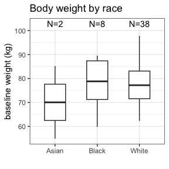

<!-- README.md is generated from README.Rmd. Please edit that file -->

# NIF

<!-- badges: start -->
<!-- badges: end -->

This is a package to create NONMEM input files (NIF) from SDTM data.

## Installation

You can install the development version of `nif` like so:

``` r
devtools::install_github("rstrotmann/nif", build_vignettes=TRUE)
```

## Example

### NIF data set creation

This is a very basic example using a sample SDTM object to create a NIF
data set using `make_nif()`:

``` r
library(nif)
library(tidyverse)

sdtm <- examplinib_sad

make_nif(sdtm) %>% 
  compress() %>%
  head()
#>   REF    STUDYID ID           USUBJID NTIME TIME TAD ANALYTE AMT RATE        DV
#> 1   1 2023000001  1 20230000011010001   0.0  0.0 0.0  RS2023   5    0        NA
#> 2   2 2023000001  1 20230000011010001   0.0  0.0 0.0  RS2023   0    0 0.0000000
#> 3   3 2023000001  1 20230000011010001   0.5  0.5 0.5  RS2023   0    0 0.0024470
#> 4   4 2023000001  1 20230000011010001   1.0  1.0 1.0  RS2023   0    0 0.0072445
#> 5   5 2023000001  1 20230000011010001   1.5  1.5 1.5  RS2023   0    0 0.0157476
#> 6   6 2023000001  1 20230000011010001   2.0  2.0 2.0  RS2023   0    0 0.0209229
#>        LNDV MDV CMT EVID DOSE AGE SEX  RACE HEIGHT WEIGHT     BMI ACTARMCD
#> 1        NA   1   1    1    5  43   0 WHITE  187.4     77 21.9256       C1
#> 2      -Inf   0   2    0   NA  43   0 WHITE  187.4     77 21.9256       C1
#> 3 -6.012892   0   2    0    5  43   0 WHITE  187.4     77 21.9256       C1
#> 4 -4.927513   0   2    0    5  43   0 WHITE  187.4     77 21.9256       C1
#> 5 -4.151067   0   2    0    5  43   0 WHITE  187.4     77 21.9256       C1
#> 6 -3.866911   0   2    0    5  43   0 WHITE  187.4     77 21.9256       C1
#>   PARENT METABOLITE TRTDY                 DTC EXSEQ      EXTRT
#> 1 RS2023      FALSE     1 2000-12-31 10:18:00     1 EXAMPLINIB
#> 2 RS2023      FALSE     1 2000-12-31 10:18:00    NA EXAMPLINIB
#> 3 RS2023      FALSE     1 2000-12-31 10:48:00     1 EXAMPLINIB
#> 4 RS2023      FALSE     1 2000-12-31 11:18:00     1 EXAMPLINIB
#> 5 RS2023      FALSE     1 2000-12-31 11:48:00     1 EXAMPLINIB
#> 6 RS2023      FALSE     1 2000-12-31 12:18:00     1 EXAMPLINIB
```

In many cases, you may want to add further covariates after
`make_nif()`, see this slightly more elaborate example:

``` r
nif <- make_nif(sdtm, silent = TRUE) %>% 
  compress() %>% 
  mutate(COHORT = ACTARMCD) %>% 
  add_bl_lab(examplinib_sad %>% domain("lb"), "CREAT") %>% 
  add_bl_crcl()

head(nif)
#>   REF    STUDYID ID           USUBJID NTIME TIME TAD ANALYTE AMT RATE        DV
#> 1   1 2023000001  1 20230000011010001   0.0  0.0 0.0  RS2023   5    0        NA
#> 2   2 2023000001  1 20230000011010001   0.0  0.0 0.0  RS2023   0    0 0.0000000
#> 3   3 2023000001  1 20230000011010001   0.5  0.5 0.5  RS2023   0    0 0.0024470
#> 4   4 2023000001  1 20230000011010001   1.0  1.0 1.0  RS2023   0    0 0.0072445
#> 5   5 2023000001  1 20230000011010001   1.5  1.5 1.5  RS2023   0    0 0.0157476
#> 6   6 2023000001  1 20230000011010001   2.0  2.0 2.0  RS2023   0    0 0.0209229
#>        LNDV MDV CMT EVID DOSE AGE SEX  RACE HEIGHT WEIGHT     BMI ACTARMCD
#> 1        NA   1   1    1    5  43   0 WHITE  187.4     77 21.9256       C1
#> 2      -Inf   0   2    0   NA  43   0 WHITE  187.4     77 21.9256       C1
#> 3 -6.012892   0   2    0    5  43   0 WHITE  187.4     77 21.9256       C1
#> 4 -4.927513   0   2    0    5  43   0 WHITE  187.4     77 21.9256       C1
#> 5 -4.151067   0   2    0    5  43   0 WHITE  187.4     77 21.9256       C1
#> 6 -3.866911   0   2    0    5  43   0 WHITE  187.4     77 21.9256       C1
#>   PARENT METABOLITE TRTDY                 DTC EXSEQ      EXTRT COHORT BL_CREAT
#> 1 RS2023      FALSE     1 2000-12-31 10:18:00     1 EXAMPLINIB     C1  67.4825
#> 2 RS2023      FALSE     1 2000-12-31 10:18:00    NA EXAMPLINIB     C1  67.4825
#> 3 RS2023      FALSE     1 2000-12-31 10:48:00     1 EXAMPLINIB     C1  67.4825
#> 4 RS2023      FALSE     1 2000-12-31 11:18:00     1 EXAMPLINIB     C1  67.4825
#> 5 RS2023      FALSE     1 2000-12-31 11:48:00     1 EXAMPLINIB     C1  67.4825
#> 6 RS2023      FALSE     1 2000-12-31 12:18:00     1 EXAMPLINIB     C1  67.4825
#>    BL_CRCL
#> 1 115.5074
#> 2 115.5074
#> 3 115.5074
#> 4 115.5074
#> 5 115.5074
#> 6 115.5074
```

### Data exploration

`nif` contains functions to explore and summarize NIF files:

``` r
summary(nif)
#> NONMEM input file (NIF) data set summary
#> 
#> Data from 48 subjects across 1 studies:
#> STUDYID      N    
#> 2023000001   48   
#> 
#> Males: 48, females: 0 (0%)
#> 
#> Renal function:
#> CLASS    N    
#> mild     6    
#> normal   42   
#> 
#> Analytes:
#> RS2023
#> 
#> 816 observations:
#> CMT   ANALYTE   N     
#> 2     RS2023    816   
#> 
#> Administered drugs:
#> RS2023
#> 
#> Dose levels:
#> COHORT   RS2023   N    
#> C1       5        3    
#> C10      500      12   
#> C2       10       3    
#> C3       20       3    
#> C4       50       3    
#> C5       100      6    
#> C6       200      3    
#> C7       500      6    
#> C8       800      6    
#> C9       1000     3    
#> 
#> Subjects with dose reductions
#> RS2023   
#> 0        
#> 
#> Treatment duration overview:
#> PARENT   min   max   mean   median   
#> RS2023   1     1     1      1

invisible(capture.output(
  summary(nif) %>%
    plot()
))
```



# Further information

For further guidance see the help for individual functions and the
[project website](https://rstrotmann.github.io/nif/) on github pages.
