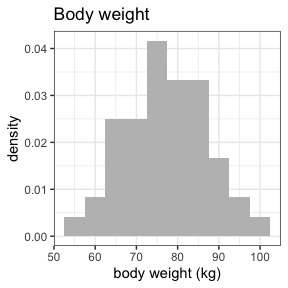
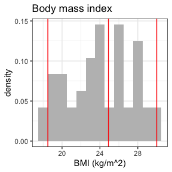

<!-- README.md is generated from README.Rmd. Please edit that file -->

# NIF

<!-- badges: start -->

[](https://CRAN.R-project.org/package=nif)
<!-- badges: end -->

This is a package to create NONMEM input file (NIF) objects from
SDTM-formatted clinical study data.

## Installation

You can install the development version of `nif` like so:

``` r
devtools::install_github("rstrotmann/nif", build_vignettes=TRUE)
```

## Example

### Generate a NIF data set

This is a very basic example using sample SDTM data from a fictional
single ascending dose study to create a NIF data set using `make_nif()`:

``` r
library(nif)
library(tidyverse)

sdtm <- examplinib_sad

nif <- new_nif() %>% 
  add_administration(sdtm, "EXAMPLINIB", analyte = "RS2023") %>% 
  add_observation(sdtm, "pc", "RS2023", analyte = "RS2023")

head(nif)
#>   ID           USUBJID    STUDYID                 DTC TIME TAFD NTIME
#> 1  1 20230000011010001 2023000001 2000-12-31 10:18:00  0.0  0.0   0.0
#> 2  1 20230000011010001 2023000001 2000-12-31 10:18:00  0.0  0.0   0.0
#> 3  1 20230000011010001 2023000001 2000-12-31 10:48:00  0.5  0.5   0.5
#> 4  1 20230000011010001 2023000001 2000-12-31 11:18:00  1.0  1.0   1.0
#> 5  1 20230000011010001 2023000001 2000-12-31 11:48:00  1.5  1.5   1.5
#> 6  1 20230000011010001 2023000001 2000-12-31 12:18:00  2.0  2.0   2.0
#>                          IMPUTATION ANALYTE PARENT METABOLITE DOSE AMT CMT EVID
#> 1  admin time imputed from PCRFTDTC  RS2023 RS2023      FALSE    5   5   1    1
#> 2                                    RS2023 RS2023      FALSE    5   0   2    0
#> 3                                    RS2023 RS2023      FALSE    5   0   2    0
#> 4                                    RS2023 RS2023      FALSE    5   0   2    0
#> 5                                    RS2023 RS2023      FALSE    5   0   2    0
#> 6                                    RS2023 RS2023      FALSE    5   0   2    0
#>        DV MDV EXDY REF SEX  RACE ETHNIC COUNTRY AGE HEIGHT WEIGHT     BMI
#> 1      NA   1    1   1   0 WHITE            DEU  43  187.4     77 21.9256
#> 2  0.0000   0   NA   2   0 WHITE            DEU  43  187.4     77 21.9256
#> 3  2.4470   0   NA   3   0 WHITE            DEU  43  187.4     77 21.9256
#> 4  7.2445   0   NA   4   0 WHITE            DEU  43  187.4     77 21.9256
#> 5 15.7476   0   NA   5   0 WHITE            DEU  43  187.4     77 21.9256
#> 6 20.9229   0   NA   6   0 WHITE            DEU  43  187.4     77 21.9256
#>   ACTARMCD            RFXSTDTC TRTDY            FIRSTDTC          FIRSTADMIN
#> 1       C1 2000-12-31 10:18:00     1 2000-12-31 10:18:00 2000-12-31 10:18:00
#> 2       C1 2000-12-31 10:18:00     1 2000-12-31 10:18:00 2000-12-31 10:18:00
#> 3       C1 2000-12-31 10:18:00     1 2000-12-31 10:18:00 2000-12-31 10:18:00
#> 4       C1 2000-12-31 10:18:00     1 2000-12-31 10:18:00 2000-12-31 10:18:00
#> 5       C1 2000-12-31 10:18:00     1 2000-12-31 10:18:00 2000-12-31 10:18:00
#> 6       C1 2000-12-31 10:18:00     1 2000-12-31 10:18:00 2000-12-31 10:18:00
#>   TAD PCELTM
#> 1 0.0   <NA>
#> 2 0.0   PT0H
#> 3 0.5 PT0.5H
#> 4 1.0   PT1H
#> 5 1.5 PT1.5H
#> 6 2.0   PT2H
```

In many cases, you may want to add further covariates, e.g., baseline
creatinine from the LB domain:

``` r
nif <- nif %>%  
  mutate(COHORT = ACTARMCD) %>% 
  add_baseline(sdtm, "lb", "CREAT") %>% 
  add_bl_crcl()
```

### Data exploration

The `nif` package provides a range of functions to explore and summarize
NIF files:

``` r
summary(nif)
#> ----- NONMEM input file (NIF) object summary -----
#> Data from 48 subjects across one study:
#>  STUDYID      N    
#>  2023000001   48   
#> 
#> Males: 48, females: 0 (0%)
#> 
#> Renal impairment class:
#>  CLASS    N    
#>  mild     6    
#>  normal   42   
#> 
#> Administered drugs:
#>  RS2023
#> 
#> Analytes:
#>  RS2023
#> 
#> Subjects per dose levels:
#>  COHORT   RS2023   N    
#>  C1       5        3    
#>  C10      500      12   
#>  C2       10       3    
#>  C3       20       3    
#>  C4       50       3    
#>  C5       100      6    
#>  C6       200      3    
#>  C7       500      6    
#>  C8       800      6    
#>  C9       1000     3    
#> 
#> 816 observations:
#>  CMT   ANALYTE   N     
#>  2     RS2023    816   
#> 
#> Subjects with dose reductions
#>  RS2023   
#>  0        
#> 
#> Treatment duration overview:
#>  PARENT   min   max   mean   median   
#>  RS2023   1     1     1      1

invisible(capture.output(
  summary(nif) %>%
    plot()
))
```



# Further information

For further guidance see the help for individual functions and the
[project website](https://rstrotmann.github.io/nif/) on github pages.
