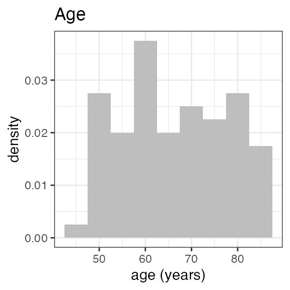
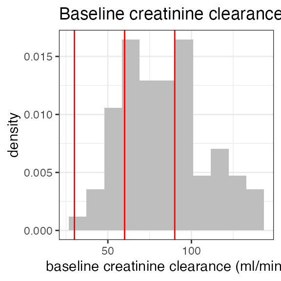
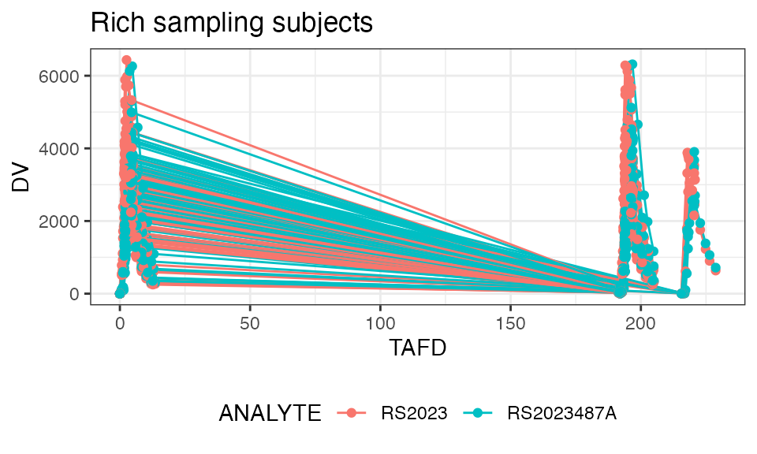

# Example: Multiple-dose study

``` r
library(dplyr)
library(tidyr)
library(ggplot2)
library(stringr)
library(nif)

theme_set(theme_bw())
```

## OVERVIEW

This vignette walks through the creation of a NONMEM Input Format (NIF)
data set for a multiple dose study (study ‘RS2023-0022’), followed by
some basic exploratory analyses.

The fictional SDTM data for this study are included as part of the NIF
package (`examplinib_poc`). Custom SDTM data can be loaded using
[`read_sdtm()`](../reference/read_sdtm.md).

### Study design

Study ‘RS2023-0022’ is a single-arm study in which subjects received
multiple doses of ‘examplinib’ (substance code ‘RS2023’). The treatment
duration is different across subjects. PK sampling was on Days 1 and 8
of the treatment period. The PK sampling schedule was rich in the
initial subset of subjects and sparse in the others.

### Study SDTM data

The package provides the ‘sdtm’ class as a wrapper to keep all SDTM
domain tables of a clinical study together in one object. The
`examplinib_poc` sdtm object contains the DM, EX, PC and VS domains.
Let’s summarize the `examplinib_poc` sdtm object for a high-level
overview:

``` r
summary(examplinib_poc)
#> -------- SDTM data set summary -------- 
#> Study 2023000022 
#> 
#> An open-label single-arm Phase 2 study of examplinib in patients
#> 
#> Data disposition
#>   DOMAIN   SUBJECTS   OBSERVATIONS   
#>   dm       89         89             
#>   vs       89         178            
#>   ex       80         477            
#>   pc       80         1344           
#>   lb       89         89             
#>   ts       0          0              
#>   pp       12         432             
#> 
#> Arms (DM):
#>   ACTARMCD    ACTARM                 
#>   SCRNFAIL    Screen Faillure        
#>   TREATMENT   Single Arm Treatment    
#> 
#> Treatments (EX):
#>   EXAMPLINIB
#> 
#> PK sample specimens (PC):
#>   PLASMA
#> 
#> PK analytes (PC):
#>   PCTEST       PCTESTCD     
#>   RS2023       RS2023       
#>   RS2023487A   RS2023487A     
#> 
#> Hash: dc62553e8fc9a5099b9b2df98196d13d
#> Last DTC: 2001-07-18 10:24:00
```

Note that in the EX domain, the administered drug is given as
‘EXAMPLINIB’ while in PC, the corresponding analyte is ‘RS2023’. The
other analyte, ‘RS2023487A’ is a metabolite.

## NIF DATA SET

Following the tutorial given in `vignette("nif-tutorial")`, we start
with a basic pharmacokinetic nif object from `examplinic_poc`:

``` r
sdtm <- examplinib_poc

nif_poc <- nif() %>%
  add_administration(sdtm, extrt = "EXAMPLINIB", analyte = "RS2023") %>%
  add_observation(sdtm, domain = "pc", testcd = "RS2023", analyte = "RS2023", cmt = 2) %>%
  add_observation(sdtm, domain = "pc", testcd = "RS2023487A", parent = "RS2023", cmt = 3)
#> ℹ Imputation model 'imputation_rules_standard' applied to administration of EXAMPLINIB
#> ℹ A global cut-off-date of 2001-07-18 08:24:00 was automatically assigned!
#> ℹ Imputation model 'imputation_rules_standard' applied to RS2023 observations
#> ℹ Imputation model 'imputation_rules_standard' applied to RS2023487A observations
```

Let’s add some further baseline data to our nif object. The serum
creatinine concentration can be used to calculate the individual
baseline creatinine clearance as an estimate for glomerular filtration
rate (eGFR).

We first add baseline creatinine from the ‘LB’ domain using the generic
[`add_baseline()`](../reference/add_baseline.md) function. Then,
creatinine clearance is calculated using
[`add_bl_crcl()`](../reference/add_bl_crcl.md). That function uses
further covariate data (sex, age, race and weight) and the
Cockcroft-Gault formula by default. For further options, see the
documentation for [`add_bl_crcl()`](../reference/add_bl_crcl.md).

``` r
nif_poc <- nif_poc %>%
  add_baseline(sdtm, domain = "lb", testcd = "CREAT") %>%
  add_bl_crcl()
#> baseline_filter for BL_CREAT set to LBBLFL == 'Y'
```

The nif data set now includes both baseline creatinine and baseline
creatinine clearance:

``` r
head(nif_poc, 3)
#    REF ID    STUDYID           USUBJID AGE SEX  RACE HEIGHT WEIGHT      BMI
#  1   1  1 2023000022 20230000221010001  81   0 WHITE  180.5   93.9 28.82114
#  2   2  1 2023000022 20230000221010001  81   0 WHITE  180.5   93.9 28.82114
#  3   3  1 2023000022 20230000221010001  81   0 WHITE  180.5   93.9 28.82114
#                    DTC TIME NTIME TAFD TAD EVID AMT    ANALYTE CMT PARENT TRTDY
#  1 2001-01-07 09:42:00    0     0    0   0    1 500     RS2023   1 RS2023     1
#  2 2001-01-07 09:42:00    0     0    0   0    0   0     RS2023   2 RS2023    NA
#  3 2001-01-07 09:42:00    0     0    0   0    0   0 RS2023487A   3 RS2023    NA
#    METABOLITE DOSE MDV  ACTARMCD                 IMPUTATION DV BL_CREAT  BL_CRCL
#  1      FALSE  500   1 TREATMENT time imputed from PCRFTDTC NA 86.46559 78.66727
#  2      FALSE  500   0 TREATMENT                             0 86.46559 78.66727
#  3      FALSE  500   0 TREATMENT                             0 86.46559 78.66727
```

## EXPLORATION

### Demographics

For an initial overview on the distribution of baseline parameters in
the study population, the administered drugs, analytes, observations,
etc., nif objects can be inspected with the
[`summary()`](https://rdrr.io/r/base/summary.html) function. After we
have added baseline creatinine clearance, the output also summarizes the
number of patients with normal renal function or impaired renal
function:

``` r
summary(nif_poc)
#  ----- NONMEM Input Format (NIF) data summary -----
#  Data from 80 subjects across one study:
#    STUDYID      N    
#    2023000022   80    
#  
#  Sex distribution:
#    SEX      N    percent   
#    male     46   57.5      
#    female   34   42.5       
#  
#  Renal impairment class:
#    CLASS      N    percent   
#    normal     26   32.5      
#    mild       43   53.8      
#    moderate   10   12.5      
#    severe     1    1.2        
#  
#  Treatments:
#    RS2023
#  
#  Analytes:
#    RS2023, RS2023487A
#  
#  Subjects per dose level:
#    RS2023   N    
#    500      80    
#  
#  1344 observations:
#    CMT   ANALYTE      N     
#    2     RS2023       672   
#    3     RS2023487A   672    
#  
#  Observations by NTIME:
#    NTIME   RS2023   RS2023487A   
#    0       160      160          
#    0.5     24       24           
#    1       24       24           
#    1.5     160      160          
#    2       24       24           
#    3       24       24           
#    4       160      160          
#    6       24       24           
#    8       24       24           
#    10      24       24           
#    12      24       24            
#  
#  Subjects with dose reductions
#    RS2023   
#    30        
#  
#  Treatment duration overview:
#    PARENT   min   max   mean   median   
#    RS2023   55    97    73.2   72.5      
#  
#  Hash: c28e0e62f9c591c4342158c658d8b55c
#  Last DTC: 2001-07-18 08:24:00
```

For a visual overview of the NIF data set
[`plot()`](https://rdrr.io/r/graphics/plot.default.html) can be applied
to the nif summary object. Ignore the `invisible(capture.output())`
construct in the below code. Its purpose is to hide non-graphical
output.

``` r
invisible(capture.output(
  plot(summary(nif_poc))
))
```



### Exposure

In this study, all 80 subject received the same dose level:

``` r
nif_poc %>%
  dose_levels() %>%
  kable(caption = "Dose levels")
```

| RS2023 |   N |
|-------:|----:|
|    500 |  80 |

Dose levels

However, there were subjects with dose reductions, as we can see when
filtering the nif data set for `EVID == 1` (i.e., administrations) and
summarizing the administered dose:

``` r
nif_poc %>%
  filter(EVID == 1) %>%
  group_by(DOSE) %>%
  summarize(n = n()) %>%
  kable()
```

| DOSE |    n |
|-----:|-----:|
|  250 | 1093 |
|  500 | 4763 |

To identify the subjects with dose reductions, we can use the
[`dose_red_sbs()`](../reference/dose_red_sbs.md) function provided by
the nif package:

``` r
nif_poc %>%
  dose_red_sbs()
#  # A tibble: 30 × 2
#        ID USUBJID          
#     <dbl> <chr>            
#   1    29 20230000221030016
#   2    34 20230000221040006
#   3    67 20230000221070001
#   4    79 20230000221080005
#   5    76 20230000221080002
#   6    13 20230000221020012
#   7    35 20230000221040007
#   8     5 20230000221010005
#   9    77 20230000221080003
#  10    32 20230000221040004
#  # ℹ 20 more rows
```

Let’s have a plot of the doses over time in these subjects:

``` r
nif_poc %>%
  filter(ID %in% (dose_red_sbs(nif_poc))$ID) %>%
  filter(EVID == 1) %>%
  ggplot(aes(x = TIME, y = DOSE, color = as.factor(ID))) +
  geom_point() +
  geom_line() +
  theme(legend.position = "none")
```


We see that dose reductions happened at different times during
treatment. Another way of visualizing this is per the
[`mean_dose_plot()`](../reference/mean_dose_plot.md) function:

``` r
nif_poc %>%
  mean_dose_plot()
```


The upper panel shows the mean dose over time, and we can see that after
~Day 13, the mean dose across all treated subjects drops due to dose
reductions in some subjects. To put this into context, the lower panel
shows the number of subjects on treatment over time, and we see that
most subjects had treatment durations of around 30 days. Note the
fluctuations that indicate single missed doses in individual subjects!

### PK sampling

The PK sampling time points in this study were:

``` r
nif_poc %>%
  filter(EVID == 0) %>%
  group_by(NTIME, ANALYTE) %>%
  summarize(n = n(), .groups = "drop") %>%
  pivot_wider(names_from = "ANALYTE", values_from = "n") %>%
  kable(caption = "Observations by time point and analyte")
```

| NTIME | RS2023 | RS2023487A |
|------:|-------:|-----------:|
|   0.0 |    160 |        160 |
|   0.5 |     24 |         24 |
|   1.0 |     24 |         24 |
|   1.5 |    160 |        160 |
|   2.0 |     24 |         24 |
|   3.0 |     24 |         24 |
|   4.0 |    160 |        160 |
|   6.0 |     24 |         24 |
|   8.0 |     24 |         24 |
|  10.0 |     24 |         24 |
|  12.0 |     24 |         24 |

Observations by time point and analyte

From the different numbers of samplings per nominal time point, we guess
that only a subset of subjects had a rich sampling scheme. Let’s
identify those:

``` r
nif_poc %>%
  rich_sampling_sbs(analyte = "RS2023", max_time = 24, n = 6)
#   [1]  1  6  7 17 18 19 20 21 30 42 54 67
```

For details, see the documentation to
[`rich_sampling_sbs()`](../reference/rich_sampling_sbs.md).

### Plasma concentration data

Let’s plot the individual and mean plasma concentration profiles on Day
1 for the parent, RS2023, and the metabolite, RS2023487A:

``` r
temp <- nif_poc %>%
  filter(ID %in% (rich_sampling_sbs(nif_poc, analyte = "RS2023", n = 4)))

temp %>%
  plot(dose = 500, points = TRUE, title = "Rich sampling subjects")
```



For single and multiple dose administrations separately:

``` r
temp <- temp %>%
  index_rich_sampling_intervals()

temp %>%
  filter(RICH_N == 1) %>%
  plot(analyte = "RS2023", mean = TRUE, title = "Single-dose PK")
```


``` r

temp %>%
  filter(RICH_N == 2) %>%
  plot(analyte = "RS2023", title = "Multiple-dose PK", time = "NTIME", mean = T)
```


The above code made use of the helper function
[`index_rich_sampling_intervals()`](../reference/index_rich_sampling_intervals.md)
that identifies dosing intervals with rich PK sampling. See the
documentation for details.

### Non-compartmental analysis

The nif package includes functions for non-compartmental PK analysis.
Essentially, [`nca()`](../reference/nca.md) is a wrapper around
[`PKNCA::pk.nca()`](http://humanpred.github.io/pknca/reference/pk.nca.md)
from the popular PKNCA package (github.com/humanpred/pkncal).

``` r
nca <- examplinib_poc_nif %>%
  index_rich_sampling_intervals(analyte = "RS2023", min_n = 4) %>%
  nca("RS2023", group = "RICH_N")

nca %>%
  nca_summary_table(group = "RICH_N") %>%
  kable()
```

| RICH_N | DOSE | n | aucinf.obs | auclast | cmax | half.life | tmax |
|:---|---:|---:|:---|:---|:---|:---|:---|
| 1 | 500 | 12 | 21258.59 (29) | 19493.05 (29) | 3542.7 (28) | 3.02 (7) | 2.48 (2.17; 3.95) |
| 2 | 500 | 12 | 21626.44 (29) | 19812.43 (29) | 3533.69 (27) | 3.05 (7) | 2.44 (1.85; 3.93) |
| NA | 250 | 1 | NA | 10796.66 (NA) | 3223.87 (NA) | NA | 2.32 (2.32; 2.32) |
| NA | 500 | 164 | NA | 6587.16 (160) | NA | NA | NA |
| NA | 500 | 170 | NA | NA | 1313.48 (642) | NA | 2.24 (1.55; 47.97) |
