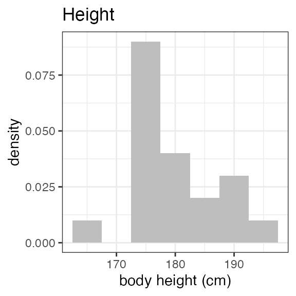
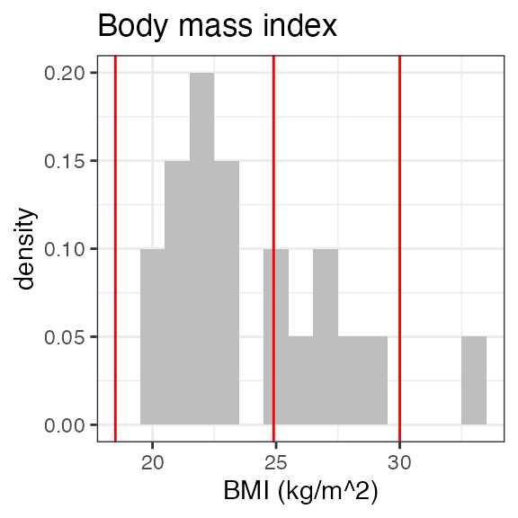
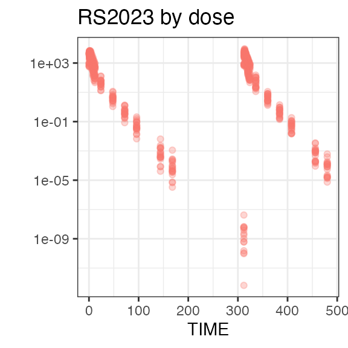
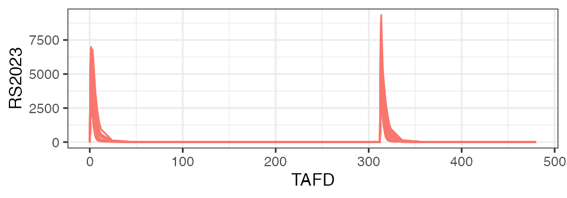
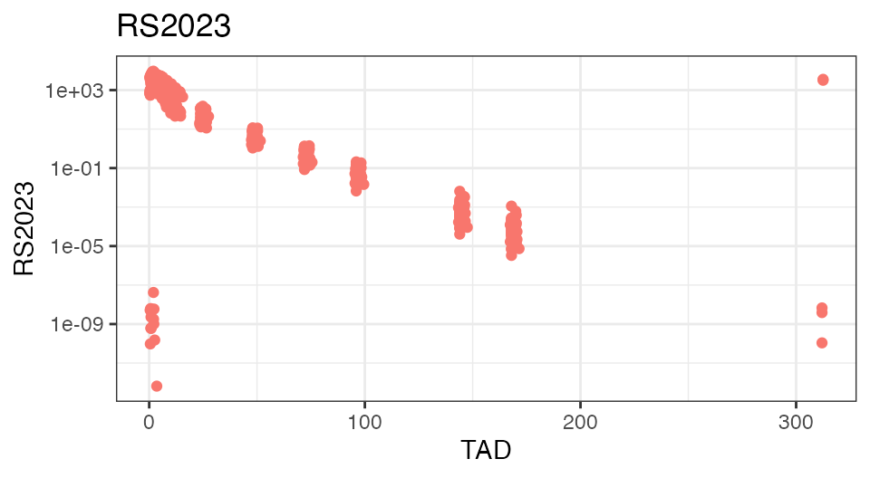
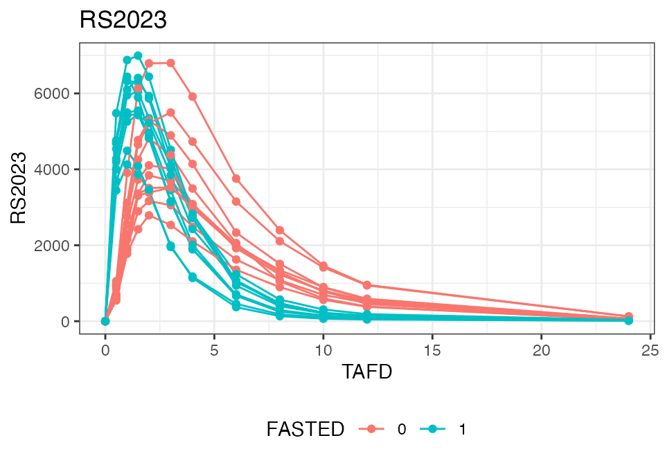
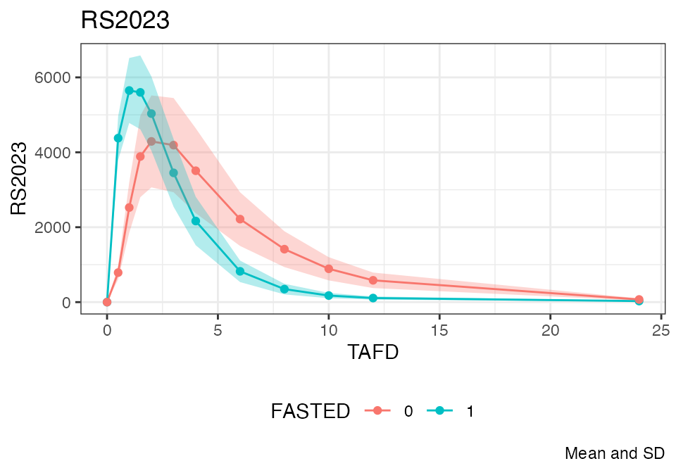

# Creating NIF files from SDTM data

## INTRODUCTION

This is a basic tutorial on using the `nif` package to create NONMEM
Input Format (NIF) data sets from Study Data Tabulation Model (SDTM)
formatted data.

### Background

Following regulatory standards, clinical study data are commonly
provided in SDTM format, an observation-based data tabulation format in
which logically related observations are organized into topical
collections (domains). SDTM is defined and maintained by the [Clinical
Data Interchange Standards Consortium
(CDISC)](https://www.cdisc.org/standards/foundational/sdtm).

To support typical pharmacometric analyses, data from different SDTM
domains need to be aggregated into a single analysis data set. For
example, demographic and pharmacokinetic concentration data from the DM
and PC domains are both required to evaluate exposure by age. More
complex analyses like population-level PK and PK/PD analyses may include
further data, e.g., clinical laboratory, vital sign, or biomarker data.

NONMEM and other modeling software packages expect the input data
provided in (long) tabular arrangement with strict requirements to the
formatting and nomenclature of the variables (see, e.g., Bauer, CPT
Pharmacometrics Syst. Pharmacol. (2019). The input data file for these
analyses is sometimes casually referred to as a ‘NONMEM input format’ or
‘NIF’ file, hence the name of this package.

Contingent on the downstream analyses, some of the variables in the
analysis data set can be easily and automatically derived from the SDTM
source data, e.g., ‘DOSE’ (the administered dose) or ‘DV’ (the dependent
variable for observations), or demographic covariates like ‘AGE’, ‘SEX’
or ‘RACE’. Other fields of the input data set may require study-specific
considerations, for example the calculation of baseline renal or hepatic
function categories, definition of specific treatment conditions by
study arm, or the encoding of adverse events or concomitant medications,
as categorical covariates.

While the latter variables often need manual and study-specific data
programming, the core NIF data set can in most cases be generated in a
quite standardized way. But also the manual addition of further
analysis-specific fields is substantially simplified by the functions
that the `nif` package provides. Often, analysis data sets can be thus
be created with only a handful of lines of code.

Even for basic NIF data sets, missing data or data inconsistencies,
specifically those relating to date and time fields, need to be resolved
to get to analysis-ready data sets. This is frequently encountered when
analyzing preliminary data from ongoing clinical studies that have not
been fully cleaned. The `nif` package provides a number of standardized
imputation rules to resolve these issues. More on this point later as
well in a separate vignette
([`vignette("nif-imputations")`](../articles/nif-imputations.md)).

Overall, the `nif` package is intended to facilitate the creation of
analysis data sets (‘NIF data sets’) from SDTM-formatted clinical data.

### Outline

The [first](#sdtm-data) part of this tutorial describes how to import
SDTM data into a `sdtm` object, and how to explore clinical data on the
SDTM level.

The [second](#nif-data-sets) part walks through the generation of a
sample `nif` data set from SDTM data to illustrate the general workflow
for building analysis data sets.

Finally, the [third](#data-exploration) part showcases some functions to
quickly explore analysis data sets.

This tutorial contains live code that depends on the following R
packages:

``` r
library(tidyr)
library(dplyr)
library(stringr)
library(nif)
```

## SDTM DATA

### Importing SDTM data

In many cases, source SDTM data are provided as one file per domain,
often in SAS binary data base storage format (.sas7bdat) or SAS
Transport File (.xpt) format.

The SDTM data can be loaded using
[`read_sdtm()`](../reference/read_sdtm.md):

``` r
read_sdtm("path/to/sdtm/data")
```

Windows users may want to provide the file path as raw string, i.e., in
the form of:

``` r
read_sdtm(r"(path\to\sdtm\data)")
```

This ensures that the backslashes in the file path are correctly
captured. Note the inner parentheses around the file path!

If no domains are explicitly specified, all files with the respective
extension are loaded (excluding file names that start with an
underscore).

The return value of this function is a `sdtm` object.

### SDTM objects

`sdtm` objects are essentially aggregates (lists) of the SDTM domains
from a particular clinical study, plus some metadata. The easiest way of
creating `sdtm` objects is by importing the SDTM data using
[`read_sdtm()`](../reference/read_sdtm.md) as shown above.

The `nif` package includes sample SDTM data sets for demonstration
purposes. These data do not come from actual clinical studies but are
fully synthetic data sets from a fictional single ascending dose (SAD)
study (`examplinib_sad`), a fictional food effect (FE) study
(`examplinib_fe`), and a fictional single-arm proof-of-concept (POC)
study with multiple-dose administrations (`examplinib_poc`).

Printing an `sdtm` object shows relevant summary information:

``` r
examplinib_fe
#> -------- SDTM data set summary -------- 
#> Study 2023000400 
#> 
#> An open-label 2-period crossover study in healthy subjects to investigate the
#> effect of food on the pharmacokinetics of examplinib
#> 
#> Data disposition
#>   DOMAIN   SUBJECTS   OBSERVATIONS   
#>   dm       28         28             
#>   vs       28         56             
#>   ex       20         40             
#>   pc       20         1360           
#>   lb       28         28             
#>   ts       0          0              
#>   pp       20         360             
#> 
#> Arms (DM):
#>   ACTARMCD   ACTARM           
#>   AB         Fasted - Fed     
#>   BA         Fed - Fasted     
#>   SCRNFAIL   Screen Failure    
#> 
#> Treatments (EX):
#>   EXAMPLINIB
#> 
#> PK sample specimens (PC):
#>   PLASMA
#> 
#> PK analytes (PC):
#>   PCTEST       PCTESTCD     
#>   RS2023       RS2023       
#>   RS2023487A   RS2023487A     
#> 
#> Hash: fe221c9908fca418b46a1bd52f7b885b
#> Last DTC: 2001-03-10 11:28:00
```

High-level subject-level disposition data for a specific subject can be
extracted using [`subject_info()`](../reference/subject_info.md):

``` r
examplinib_fe %>%
  subject_info("20230004001050001")
#>          [,1]                     
#> SITEID   105                      
#> SUBJID   1050001                  
#> ACTARM   Fasted - Fed             
#> ACTARMCD AB                       
#> RFICDTC  2000-12-26T10:05         
#> RFSTDTC  2001-01-05T10:05         
#> RFXSTDTC 2001-01-05T10:05         
#> STUDYID  2023000400               
#> USUBJID  20230004001050001        
#> SEX      M                        
#> AGE      34                       
#> AGEU     YEARS                    
#> COUNTRY  DEU                      
#> DOMAIN   DM                       
#> ARM      Fasted - Fed             
#> ARMCD    AB                       
#> RACE     BLACK OR AFRICAN AMERICAN
#> ETHNIC                            
#> RFENDTC  2001-01-18T10:05
```

The original SDTM data for specific domains can be retrieved from `sdtm`
objects with the [`domain()`](../reference/domain.md) function:

``` r
domain(examplinib_sad, "dm") %>%
  head(3)
#>   SITEID  SUBJID                              ACTARM ACTARMCD          RFICDTC
#> 1    101 1010001 Treatment cohort 1, 5 mg examplinib       C1 2000-12-21T10:18
#> 2    101 1010002 Treatment cohort 1, 5 mg examplinib       C1 2000-12-21T10:30
#> 3    101 1010003 Treatment cohort 1, 5 mg examplinib       C1 2000-12-21T09:22
#>            RFSTDTC         RFXSTDTC    STUDYID           USUBJID SEX AGE  AGEU
#> 1 2000-12-31T10:18 2000-12-31T10:18 2023000001 20230000011010001   M  43 YEARS
#> 2 2000-12-29T10:30 2000-12-29T10:30 2023000001 20230000011010002   M  49 YEARS
#> 3 2000-12-29T09:22 2000-12-29T09:22 2023000001 20230000011010003   M  46 YEARS
#>   COUNTRY DOMAIN                                 ARM ARMCD
#> 1     DEU     DM Treatment cohort 1, 5 mg examplinib    C1
#> 2     DEU     DM Treatment cohort 1, 5 mg examplinib    C1
#> 3     DEU     DM Treatment cohort 1, 5 mg examplinib    C1
#>                        RACE ETHNIC          RFENDTC
#> 1                     WHITE        2000-12-31T10:18
#> 2                     WHITE        2000-12-29T10:30
#> 3 BLACK OR AFRICAN AMERICAN        2000-12-29T09:22
```

[`summary()`](https://rdrr.io/r/base/summary.html) generates a
high-level data disposition overview on a specific domain:

``` r
summary(domain(examplinib_sad, "pc"), silent = TRUE)
#> -------- SDTM domain summary -------- 
#> Study 2023000001 
#> Domain PC 
#> 48 subjects
#> 1632 observations
#> 
#> Testcodes
#>   PCTEST       PCTESTCD     PCSPEC   
#>   RS2023       RS2023       PLASMA   
#>   RS2023487A   RS2023487A   PLASMA     
#> 
#> Observation time points
#>   PCTPT                 PCTPTNUM   PCELTM   
#>   PREDOSE               0          PT0H     
#>   0.5 HOURS POST-DOSE   0.5        PT0.5H   
#>   1 HOURS POST-DOSE     1          PT1H     
#>   1.5 HOURS POST-DOSE   1.5        PT1.5H   
#>   2 HOURS POST-DOSE     2          PT2H     
#>   3 HOURS POST-DOSE     3          PT3H     
#>   4 HOURS POST-DOSE     4          PT4H     
#>   6 HOURS POST-DOSE     6          PT6H     
#>   8 HOURS POST-DOSE     8          PT8H     
#>   10 HOURS POST-DOSE    10         PT10H     
#>   (7 more rows) 
#> 
#> Epochs
#>   OPEN LABEL TREATMENT     
#> Hash: d29adb9ffafcfd308f6b38947fefecde
#> Last DTC: 2001-03-02 12:31:00
```

A graphical timeline overview can be generated for a specific domain by,
e.g.:

``` r
plot(examplinib_fe, "dm")
```

### SDTM suggestions

SDTM data may be incomplete, e.g., when emerging data that have not yet
been fully cleaned are analyzed. In addition, some study-specific data
may be encoded in a non-standardized way, e.g., information on study
parts, cohorts, treatment conditions, etc..

Such data fields may need study-specific considerations and manual
imputations during the creating of the analysis data set. To help
deciding which study-specific factors need to be addressed, the `nif`
package includes functions to explore the structure of SDTM data.

As we will see in [NIF DATA SETS](#nif-data-sets), nif objects are built
sequentially from the SDTM data set. Based on the actual data
disposition, the [`suggest()`](../reference/suggest.md) function provide
useful code snippets for the creation of analysis data sets:

``` r
suggest(examplinib_fe)
#> 
#> ── 1. Treatments ───────────────────────────────────────────────────────────────
#> There are 1 treatments (EXTRT) in EX: EXAMPLINIB. Consider adding them to the
#> nif object using `add_administration()`, see the code snippet below (replace
#> 'sdtm' with the name of your sdtm object):
#> 
#>   add_administration(sdtm, 'EXAMPLINIB')
#> 
#> ── 2. Pharmacokinetic observations ─────────────────────────────────────────────
#> There are 2 pharmacokinetic analytes:
#> 
#>   PCTEST       PCTESTCD     
#>   RS2023       RS2023       
#>   RS2023487A   RS2023487A
#> 
#> Consider adding them to the nif object using `add_observation()`, see the code
#> snippet below (replace 'sdtm' with the name of your sdtm object):
#> 
#>   add_observation(sdtm, 'pc', 'RS2023')
#>   add_observation(sdtm, 'pc', 'RS2023487A')
#> 
#> ── NTIME definition ──
#> 
#> The PC domain contains multiple fields that the nominal sampling time can be
#> derived from:
#> 
#>   PCTPT                 PCTPTNUM   PCELTM   
#>   PREDOSE               0          PT0H     
#>   0.5 HOURS POST-DOSE   0.5        PT0.5H   
#>   1 HOURS POST-DOSE     1          PT1H     
#>   1.5 HOURS POST-DOSE   1.5        PT1.5H   
#>   2 HOURS POST-DOSE     2          PT2H     
#>   3 HOURS POST-DOSE     3          PT3H     
#>   4 HOURS POST-DOSE     4          PT4H     
#>   6 HOURS POST-DOSE     6          PT6H     
#>   8 HOURS POST-DOSE     8          PT8H     
#>   10 HOURS POST-DOSE    10         PT10H    
#>   12 HOURS POST-DOSE    12         PT12H    
#>   24 HOURS POST-DOSE    24         PT24H    
#>   48 HOURS POST-DOSE    48         PT48H    
#>   72 HOURS POST-DOSE    72         PT72H    
#>   96 HOURS POST-DOSE    96         PT96H    
#>   144 HOURS POST-DOSE   144        PT144H   
#>   168 HOURS POST-DOSE   168        PT168H
#> 
#> Consider specifying a suitabe 'ntime_method' argument to 'add_observation()'.
#> By default, the function will attempt to extract time information from the
#> PCTPT field.
#> 
#> ── 3. Study arms ───────────────────────────────────────────────────────────────
#> There are 3 study arms defined in DM:
#> 
#>   ACTARMCD   ACTARM           
#>   AB         Fasted - Fed     
#>   BA         Fed - Fasted     
#>   SCRNFAIL   Screen Failure
#> 
#> Consider defining a PART or ARM variable, filtering for a particular arm, or
#> defining a covariate based on ACTARMCD.
#> 
#> ── 4. Baseline covariates ──────────────────────────────────────────────────────
#> The LB domains contains creatinine (CREAT) observations. Consider adding a
#> baseline creatinine covariate, baseline creatinine clearance (BL_CRCL) and
#> baseline renal function category:
#> 
#>   add_baseline(sdtm, 'lb', 'CREAT')
#>   add_bl_crcl()
#>   add_bl_renal()
```

In the above example, suggestions 1 and 2 provide code for the creation
of administration and observation events. We will use this code directly
as provided in section \[Creating NIF data sets\].

Suggestion 3 notes that the DM domain defines different treatment arms
that should probably be included as covariates in the analysis data set.
They specify the sequence of fasted and fed administrations in this
study. We will deal with this in [Study-specific
covariates](#study-specific-covariates).

## NIF DATA SETS

The following sections continue using the `examplinib_fe` example to
demonstrate how a `nif` object is created from the `sdtm` data object.

### Basic NIF file

Depending on the analysis needs, `nif` objects are built in a stepwise
manner, starting from an empty `nif` object, sequentially adding
treatment administrations, observations, and covariate fields. The
result is a data table with individual rows for administrations and
observations that follows the naming conventions summarized in Bauer,
CPT Pharmacometrics Syst. Pharmacol. (2019).

The basic `nif` object automatically includes standard demographic
parameters as subject-level covariates: SEX, AGE and RACE, and baseline
WEIGHT and HEIGHT are taken from the DM and VS domains, respectively,
and merged into the data set as columns of those names:

``` r
sdtm <- examplinib_fe

nif <- nif() %>%
  add_administration(sdtm, "EXAMPLINIB", analyte = "RS2023") %>%
  add_observation(sdtm, "pc", "RS2023")
```

Note that in the above, the name of the treatment, i.e., the value of
the ‘EXTRT’ field is ‘EXAMPLINIB’ while the pharmacokinetic analyte name
(‘PCTESTCD’) is ‘RS2023’. To harmonize both, the ‘analyte’ parameter in
[`add_administration()`](../reference/add_administration.md) was set to
‘RS2023’, too.

These are the first rows of the resulting data table:

``` r
head(nif, 5)
#>   REF ID    STUDYID           USUBJID AGE SEX  RACE HEIGHT WEIGHT      BMI
#> 1   1  1 2023000400 20230004001010002  53   1 WHITE  180.4   73.1 22.46179
#> 2   2  1 2023000400 20230004001010002  53   1 WHITE  180.4   73.1 22.46179
#> 3   3  1 2023000400 20230004001010002  53   1 WHITE  180.4   73.1 22.46179
#> 4   4  1 2023000400 20230004001010002  53   1 WHITE  180.4   73.1 22.46179
#> 5   5  1 2023000400 20230004001010002  53   1 WHITE  180.4   73.1 22.46179
#>                   DTC TIME NTIME TAFD TAD EVID AMT ANALYTE CMT PARENT TRTDY
#> 1 2001-01-05 10:05:00  0.0   0.0  0.0 0.0    1 500  RS2023   1 RS2023     1
#> 2 2001-01-05 10:05:00  0.0   0.0  0.0 0.0    0   0  RS2023   2 RS2023     1
#> 3 2001-01-05 10:35:00  0.5   0.5  0.5 0.5    0   0  RS2023   2 RS2023     1
#> 4 2001-01-05 11:05:00  1.0   1.0  1.0 1.0    0   0  RS2023   2 RS2023     1
#> 5 2001-01-05 11:35:00  1.5   1.5  1.5 1.5    0   0  RS2023   2 RS2023     1
#>   METABOLITE DOSE MDV ACTARMCD IMPUTATION       DV
#> 1      FALSE  500   1       AB                  NA
#> 2      FALSE  500   0       AB               0.000
#> 3      FALSE  500   0       AB            4697.327
#> 4      FALSE  500   0       AB            6325.101
#> 5      FALSE  500   0       AB            6294.187
```

### Multiple analytes

To demonstrate how to add multiple analytes to a `nif` object, we will
temporarily switch to another built-in sample data set,
`examplinib_sad`. This `sdtm` object includes pharmacokinetic
concentration data for the M1 metabolite of ‘EXAMPLINIB’ under the
PCTESTCD of ‘RS2023487A’. Note how in the below code, the two analyte
observations are added to the data set, setting the metabolite’s name to
‘M1’, and how its relation to the parent compound is established using
the ‘parent’ parameter:

``` r
sdtm1 <- examplinib_sad

nif1 <- nif() %>%
  add_administration(sdtm, "EXAMPLINIB", analyte = "RS2023") %>%
  add_observation(sdtm, "pc", "RS2023") %>%
  add_observation(sdtm, "pc", "RS2023487A", analyte = "M1", parent = "RS2023")
```

In analogy to PK observations, observations from any SDTM domain, e.g.,
LB, VS, MB, TR, etc., can be added in very much the same way. Please see
the documentation to
[`add_observation()`](../reference/add_observation.md) for details. This
is a powerful feature that allows effortless construction of analysis
data sets for population PK/PD modeling.

### Study-specific covariates

In this simulated study, participants had received the test drug,
EXAMPLINIB, under fasted or fed conditions in a randomized sequence (see
‘ACTARM’ and ‘ACTARMCD’ in the output of
[`suggest()`](../reference/suggest.md)), where the ‘EPOCH’ field in the
EX domain provides information on the current treatment period. It
should be noted that the way such information is encoded in the SDTM
data varies considerably. This is an example, and the specifics of how
covariate information can extracted from a SDTM data set will differ
across studies. However, `nif` objects are essentially data frame
objects and can thus be easily manipulated, e.g., using functions from
the `dplyr` package.

The following code shows how in this specific case, covariates relating
to the current treatment period (‘PERIOD’) and current treatment
(‘TREATMENT’) are sequentially derived and eventually used to create the
‘FASTED’ covariate.

Note that the ‘EPOCH’ field is not a standard field to be imported from
the SDTM data but can be included using the `keep` parameter in
[`add_administration()`](../reference/add_administration.md):

``` r
nif <- nif() %>%
  add_administration(
    examplinib_fe, "EXAMPLINIB",
    analyte = "RS2023", keep = "EPOCH"
  ) %>%
  add_observation(examplinib_fe, "pc", "RS2023") %>%
  mutate(PERIOD = str_sub(EPOCH, -1, -1)) %>%
  mutate(TREATMENT = str_sub(ACTARMCD, PERIOD, PERIOD)) %>%
  mutate(FASTED = case_when(TREATMENT == "A" ~ 1, .default = 0))
```

These are again the first 3 lines of the resulting nif object:

``` r
head(nif, 3)
#>   REF ID    STUDYID           USUBJID AGE SEX  RACE HEIGHT WEIGHT      BMI
#> 1   1  1 2023000400 20230004001010002  53   1 WHITE  180.4   73.1 22.46179
#> 2   2  1 2023000400 20230004001010002  53   1 WHITE  180.4   73.1 22.46179
#> 3   3  1 2023000400 20230004001010002  53   1 WHITE  180.4   73.1 22.46179
#>                   DTC TIME NTIME TAFD TAD EVID AMT ANALYTE CMT PARENT TRTDY
#> 1 2001-01-05 10:05:00  0.0   0.0  0.0 0.0    1 500  RS2023   1 RS2023     1
#> 2 2001-01-05 10:05:00  0.0   0.0  0.0 0.0    0   0  RS2023   2 RS2023     1
#> 3 2001-01-05 10:35:00  0.5   0.5  0.5 0.5    0   0  RS2023   2 RS2023     1
#>   METABOLITE DOSE MDV ACTARMCD IMPUTATION       DV                  EPOCH
#> 1      FALSE  500   1       AB                  NA OPEN LABEL TREATMENT 1
#> 2      FALSE  500   0       AB               0.000 OPEN LABEL TREATMENT 1
#> 3      FALSE  500   0       AB            4697.327 OPEN LABEL TREATMENT 1
#>   PERIOD TREATMENT FASTED
#> 1      1         A      1
#> 2      1         A      1
#> 3      1         A      1
```

## DATA EXPLORATION

### Data disposition

It is generally an excellent idea to explore data sets before proceeding
into more complex analyses. The `nif` package provides a host of
functions to this end. The following section shows some basic examples.

The [`summary()`](https://rdrr.io/r/base/summary.html) function
generates a general overview on the data disposition in a `nif` data
set:

``` r
summary(nif)
#> ----- NONMEM Input Format (NIF) data summary -----
#> Data from 20 subjects across one study:
#>   STUDYID      N    
#>   2023000400   20    
#> 
#> Sex distribution:
#>   SEX      N    percent   
#>   male     13   65        
#>   female   7    35         
#> 
#> Treatments:
#>   RS2023
#> 
#> Analytes:
#>   RS2023
#> 
#> Subjects per dose level:
#>   RS2023   N    
#>   500      20    
#> 
#> 680 observations:
#>   CMT   ANALYTE   N     
#>   2     RS2023    680    
#> 
#> Sampling schedule:
#>   NTIME   RS2023   
#>   0       X        
#>   0.5     X        
#>   1       X        
#>   1.5     X        
#>   2       X        
#>   3       X        
#>   4       X        
#>   6       X        
#>   8       X        
#>   10      X         
#>   (7 more rows)
#> 
#> Subjects with dose reductions
#>   RS2023   
#>   0         
#> 
#> Treatment duration overview:
#>   PARENT   min   max   mean   median   
#>   RS2023   2     2     2      2         
#> 
#> Hash: 18f2357de9faa8fcc64cb06f04f8d3b0
#> Last DTC: 2001-03-10 10:28:00
```

Plotting the summary yields histograms of the baseline demographic
covariates and raw plots of the analytes over time. In the following
code, ignore the `ìnvisible(capture.output())` construct around the
[`plot()`](https://rdrr.io/r/graphics/plot.default.html) function. Its
sole purpose is to omit some non-graphical output:

``` r
invisible(capture.output(
  nif %>%
    summary() %>%
    plot()
))
```



### Plasma concentration data

`nif` objects can be easily plotted as time series charts using the
generic [`plot()`](https://rdrr.io/r/graphics/plot.default.html)
function. While the output is a standard ggplot2 object that can be
further extended using ggplot2 functionality, the
[`plot()`](https://rdrr.io/r/graphics/plot.default.html) function itself
includes extensive parameters to achieve the desired data visualization.

In its simplest form,
[`plot()`](https://rdrr.io/r/graphics/plot.default.html) includes all
analytes, and uses ‘time after first dose’ (‘TAFD’) as the time metric:

``` r
plot(nif)
```



To check the integrity of the data set, it is often helpful to plot the
analyte concentrations over time-after-dose (TAD):

``` r
nif %>%
  plot(time = "TAD", points = TRUE, lines = FALSE, log = TRUE)
```



To demonstrate the food effect on Cmax and Tmax on the individual level,
the below figure focuses on the first 24 hours on the linear scale and
introduces coloring based on the ‘FASTED’ covariate field:

``` r
nif %>%
  plot(color = "FASTED", max_time = 24, points = TRUE)
```



The following compares the mean plasma concentration profiles:

``` r
nif %>%
  plot(color = "FASTED", max_time = 24, mean = TRUE, points = TRUE)
```



Refer to the documentation of [`plot.nif()`](../reference/plot.nif.md)
for further options.

### NIF viewer

[`nif_viewer()`](../reference/nif_viewer.md) is a powerful exploratory
tool that lets you interactively explore all analyte profiles on an
individual level. As the static nature of a vignette does not allow to
fully appreciate its potential, you are encouraged to test
[`nif_viewer()`](../reference/nif_viewer.md) within your RStudio.

``` r
nif_viewer(nif)
```
