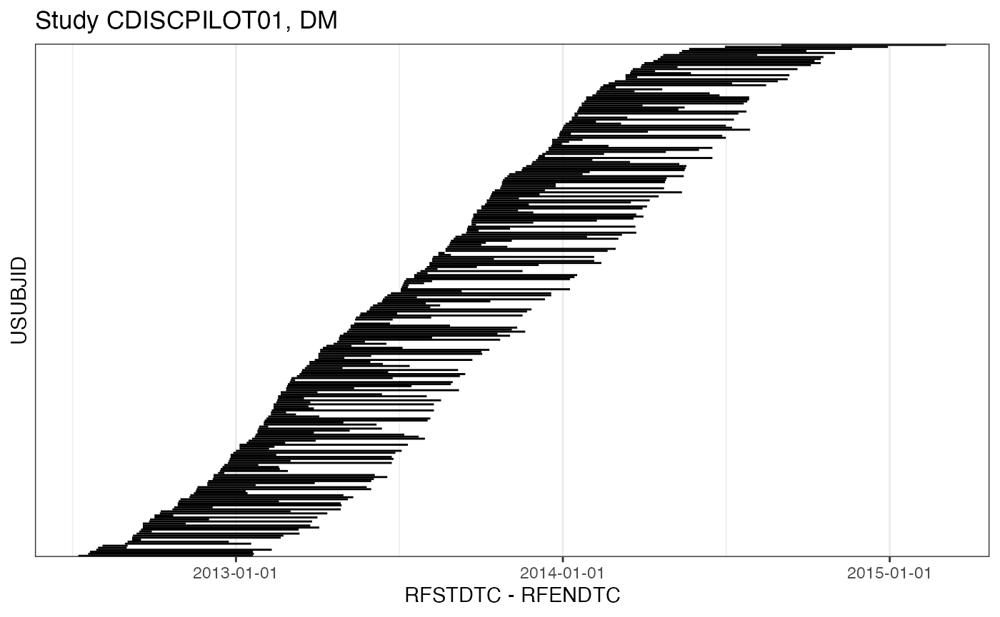

# pharmaverse-example

## INTRODUCTION

This tutorial contains live code that depends on the following R
packages:

``` r
library(dplyr)
library(ggplot2)
library(nif)
library(pharmaversesdtm)
```

## SDTM DATA

CDISCPILOT01

``` r
# source: https://github.com/pharmaverse/pharmaversesdtm.git

sdtm <- new_sdtm(
  list(
    dm = pharmaversesdtm::dm,
    ex = pharmaversesdtm::ex,
    vs = pharmaversesdtm::vs,
    pc = pharmaversesdtm::pc,
    lb = pharmaversesdtm::lb,
    ts = pharmaversesdtm::ts,
    eg = pharmaversesdtm::eg,
    ae  = pharmaversesdtm::ae
  )
)
```

``` r
summary(sdtm)
#> -------- SDTM data set summary -------- 
#> Study CDISCPILOT01 
#> 
#> Safety and Efficacy of the Xanomeline Transdermal Therapeutic System (TTS) in
#> Patients with Mild to Moderate Alzheimers Disease.
#> 
#> Data disposition
#>   DOMAIN   SUBJECTS   OBSERVATIONS   
#>   dm       306        306            
#>   ex       254        591            
#>   vs       254        29643          
#>   pc       254        4572           
#>   lb       254        59580          
#>   ts       0          0              
#>   eg       254        26717          
#>   ae       225        1191            
#> 
#> Arms (DM):
#>   ACTARMCD   ACTARM                 
#>   Pbo        Placebo                
#>   Scrnfail   Screen Failure         
#>   Xan_Hi     Xanomeline High Dose   
#>   Xan_Lo     Xanomeline Low Dose     
#> 
#> Treatments (EX):
#>   PLACEBO, XANOMELINE
#> 
#> PK sample specimens (PC):
#>   PLASMA, URINE
#> 
#> PK analytes (PC):
#>   PCTEST       PCTESTCD   
#>   XANOMELINE   XAN          
#> 
#> Hash: ea521310d575b59e085e2909e748c533
#> Last DTC: 2015-03-05 15:40:00

plot(sdtm, domain = "dm", points = F)
```



## NONMEM INPUT FORMAT DATA

``` r
nif_option(silent = TRUE, debug = TRUE)

nif <- new_nif() |> 
  add_administration(sdtm, 'XANOMELINE', analyte = "XAN") |> 
  add_administration(sdtm, 'PLACEBO') |> 
  add_observation(sdtm, 'pc', 'XAN', observation_filter = "PCSPEC == 'PLASMA'") |> 
  add_observation(sdtm, 'lb', 'ALT', ntime_method = "DY") |> 
  add_baseline(sdtm, "lb", "CREAT") |> 
  add_bl_renal() |> 
  add_cfb() |> 
  add_dose_level()
```

``` r
summary(nif)
#> ----- NONMEM Input Format (NIF) data summary -----
#> Data from 254 subjects across one study:
#>   STUDYID        N     
#>   CDISCPILOT01   254    
#> 
#> Sex distribution:
#>   SEX      N     percent   
#>   male     111   43.7      
#>   female   143   56.3       
#> 
#> Renal impairment class:
#>   CLASS      N     percent   
#>   normal     2     0.8       
#>   mild       31    12.2      
#>   moderate   196   77.2      
#>   severe     22    8.7       
#>   NA         3     1.2        
#> 
#> Treatments:
#>   PLACEBO, XAN
#> 
#> Analytes:
#>   ALT, XAN
#> 
#> Subjects per dose level:
#>   PLACEBO   XAN   N     
#>   0         0     86    
#>   0         54    168    
#> 
#> 5370 observations:
#>   CMT   ANALYTE   N      
#>   2     XAN       3556   
#>   3     ALT       1814    
#> 
#> Sampling schedule:
#>   NTIME                ALT   XAN   
#>   -2448                X           
#>   -2184                X           
#>   -1920                X           
#>   -1896                X           
#>   -1584                X           
#>   -1560                X           
#>   -1536                X           
#>   -1248                X           
#>   -1200                X           
#>   -1056                X            
#>   (202 more rows)
#> 
#> Subjects with dose reductions
#>   PLACEBO   XAN   
#>   0         0      
#> 
#> Treatment duration overview:
#>   PARENT    min   max   mean    median   
#>   PLACEBO   7     210   149.1   182      
#>   XAN       1     212   99.2    81        
#> 
#> Hash: 3fd0f9c6cf19183574a4837a42e500cc
#> Last DTC: 2015-03-05 14:40:00

invisible(capture.output(
  plot(summary(nif))
))
```


## DATA EXPLORATION

### Exposure

``` r
mean_dose_plot(nif)
```


### Pharmacokinetics

``` r
plot(nif, "XAN")
#> `geom_line()`: Each group consists of only one observation.
#> ℹ Do you need to adjust the group aesthetic?
```


