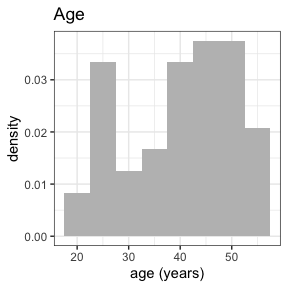
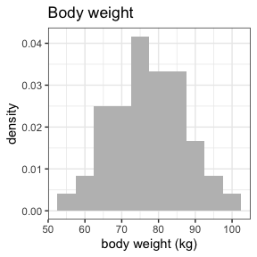
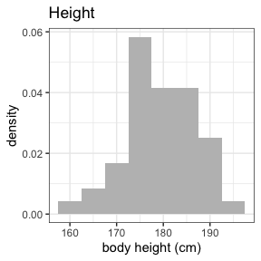
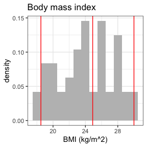
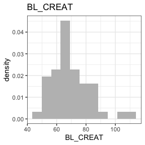
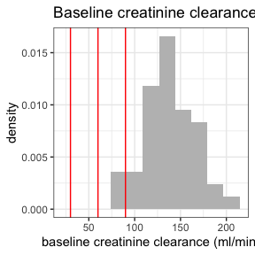
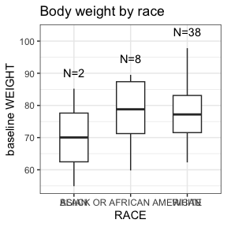
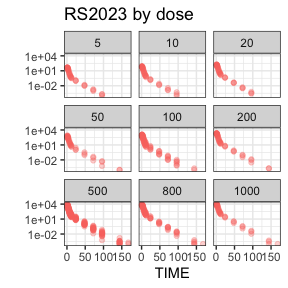

# NIF

This is a package to create NONMEM Input Format (NIF) data tables from
SDTM-formatted clinical study data.

The [NONMEM](https://www.iconplc.com/solutions/technologies/nonmem)
software that is often used for population
pharmacokinetic/pharmacodynamic (PK/PD) modeling expects the input data
set to follow specific conventions summarized in *Bauer, R.J. (2019),
NONMEM Tutorial Part I: Description of Commands and Options, With Simple
Examples of Population Analysis. CPT Pharmacometrics Syst. Pharmacol.,
8: 525-537*.

This package provides functions to sequentially aggregate drug
administrations, PK/PD observations and covariates into a
NONMEM-compliant analysis data set (NIF data set), and tools to explore
and visualize NIF data sets.

## Installation

You can install the development version of `nif` like this:

``` r

devtools::install_github("rstrotmann/nif", build_vignettes=TRUE)
```

## Example

### Generate a NIF data set

This is a very basic example using sample SDTM data from a fictional
single ascending dose study to create a NIF data set using `make_nif()`:

``` r

library(nif)
library(tidyverse)

sdtm <- examplinib_sad

nif <- nif() %>%
  add_administration(sdtm, "EXAMPLINIB", analyte = "RS2023") %>%
  add_observation(sdtm, "pc", "RS2023", analyte = "RS2023")

head(nif)
#>   REF ID    STUDYID           USUBJID AGE SEX  RACE HEIGHT WEIGHT     BMI
#> 1   1  1 2023000001 20230000011010001  43   0 WHITE  187.4     77 21.9256
#> 2   2  1 2023000001 20230000011010001  43   0 WHITE  187.4     77 21.9256
#> 3   3  1 2023000001 20230000011010001  43   0 WHITE  187.4     77 21.9256
#> 4   4  1 2023000001 20230000011010001  43   0 WHITE  187.4     77 21.9256
#> 5   5  1 2023000001 20230000011010001  43   0 WHITE  187.4     77 21.9256
#> 6   6  1 2023000001 20230000011010001  43   0 WHITE  187.4     77 21.9256
#>                   DTC TIME NTIME TAFD TAD EVID AMT CMT      DV ANALYTE PARENT
#> 1 2000-12-31 10:18:00  0.0   0.0  0.0 0.0    1   5   1      NA  RS2023 RS2023
#> 2 2000-12-31 10:18:00  0.0   0.0  0.0 0.0    0   0   2  0.0000  RS2023 RS2023
#> 3 2000-12-31 10:48:00  0.5   0.5  0.5 0.5    0   0   2 40.7852  RS2023 RS2023
#> 4 2000-12-31 11:18:00  1.0   1.0  1.0 1.0    0   0   2 48.5530  RS2023 RS2023
#> 5 2000-12-31 11:48:00  1.5   1.5  1.5 1.5    0   0   2 44.0391  RS2023 RS2023
#> 6 2000-12-31 12:18:00  2.0   2.0  2.0 2.0    0   0   2 34.0729  RS2023 RS2023
#>   TRTDY METABOLITE DOSE MDV ACTARMCD               IMPUTATION
#> 1     1      FALSE    5   1       C1 time copied from EXSTDTC
#> 2     1      FALSE    5   0       C1                         
#> 3     1      FALSE    5   0       C1                         
#> 4     1      FALSE    5   0       C1                         
#> 5     1      FALSE    5   0       C1                         
#> 6     1      FALSE    5   0       C1
```

In many cases, you may want to add further covariates, e.g., baseline
creatinine from the LB domain:

``` r

nif <- nif %>%
  mutate(COHORT = ACTARMCD) %>%
  add_baseline(sdtm, "lb", "CREAT") %>%
  add_bl_crcl()
#> ℹ baseline_filter for BL_CREAT set to LBBLFL == 'Y'
```

### Data exploration

The `nif` package provides a range of functions to explore and summarize
NIF files:

``` r

summary(nif)
#> ──────── NONMEM Input Format (NIF) data summary ────────
#> Data from 48 subjects across one study:
#>   STUDYID     N   
#>   2023000001  48
#> 
#> Sex distribution:
#>   SEX     N   percent  
#>   male    48  100      
#>   female  0   0
#> 
#> Renal impairment class:
#>   CLASS     N   percent  
#>   normal    46  95.8     
#>   mild      2   4.2      
#>   moderate  0   0        
#>   severe    0   0
#> 
#> Treatments: RS2023
#> 
#> Analytes: RS2023
#> 
#> Subjects per dose level:
#>   DL           n   
#>   5-RS2023     3   
#>   10-RS2023    3   
#>   20-RS2023    3   
#>   50-RS2023    3   
#>   100-RS2023   6   
#>   200-RS2023   3   
#>   500-RS2023   18  
#>   800-RS2023   6   
#>   1000-RS2023  3
#> 
#> 816 observations:
#>   CMT  ANALYTE  n    
#>   2    RS2023   816
#> 
#> Observations by NTIME:
#>   NTIME  RS2023  
#>   0      48      
#>   0.5    48      
#>   1      48      
#>   1.5    48      
#>   2      48      
#>   3      48      
#>   4      48      
#>   6      48      
#>   8      48      
#>   10     48      
#>   (7 more rows)
#> 
#> Subjects with dose reductions:
#>   treatment  n  
#>   RS2023     0
#> 
#> Treatment duration overview:
#>   PARENT  min  max  mean  median  
#>   RS2023  1    1    1     1
#> 
#> Hash: 23e082c5dba19799165cbe0b10b9b947
#> Last DTC: 2001-03-02 11:31:00

invisible(capture.output(
  summary(nif) %>%
    plot()
))
```



# Further information

For further guidance see the help for individual functions and the
[project website](https://rstrotmann.github.io/nif/) on github pages.
